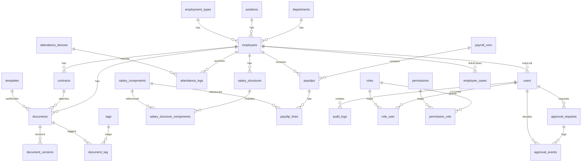

# HRMS ERD (Mermaid) — Updated

```mermaid
erDiagram
  departments ||--o{ employees : has
  positions ||--o{ employees : has
  employment_types ||--o{ employees : has
  employees ||--o{ contracts : has
  employees ||--o{ documents : has
  contracts ||--o{ documents : attaches
  documents ||--o{ document_versions : versions
  tags ||--o{ document_tag : maps
  documents ||--o{ document_tag : tagged
  employees ||--o{ salary_structures : has
  salary_structures ||--o{ salary_structure_components : includes
  salary_components ||--o{ salary_structure_components : referenced
  payroll_runs ||--o{ payslips : contains
  employees ||--o{ payslips : receives
  payslips ||--o{ payslip_lines : has
  salary_components ||--o{ payslip_lines : referenced
  employees ||--o{ attendance_logs : punches
  attendance_devices ||--o{ attendance_logs : records
  templates ||--o{ documents : canRender
  users ||--o{ audit_logs : creates
  users ||--o{ role_user : assigned
  roles ||--o{ role_user : maps
  roles ||--o{ permission_role : grants
  permissions ||--o{ permission_role : maps
  employees ||--o{ users : mayLink

  approval_requests ||--o{ approval_events : logs
  users ||--o{ approval_requests : requests
  users ||--o{ approval_events : decides

  employees ||--o{ employee_cases : linksCases
```
