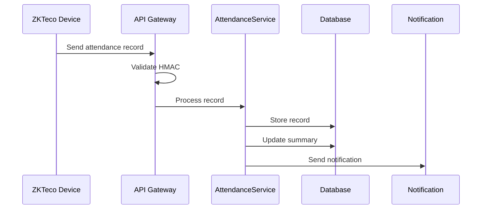
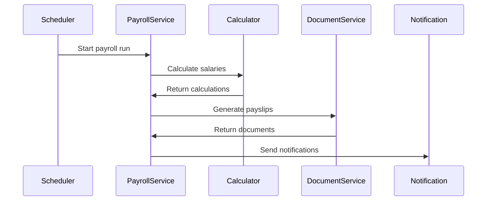
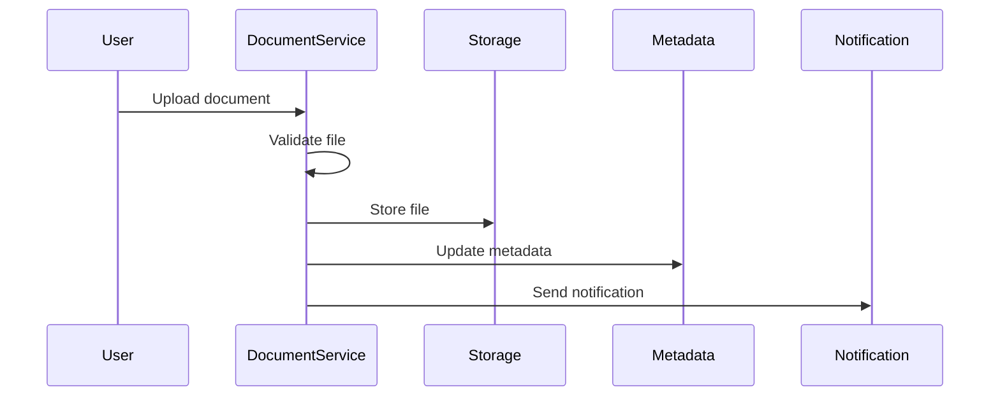
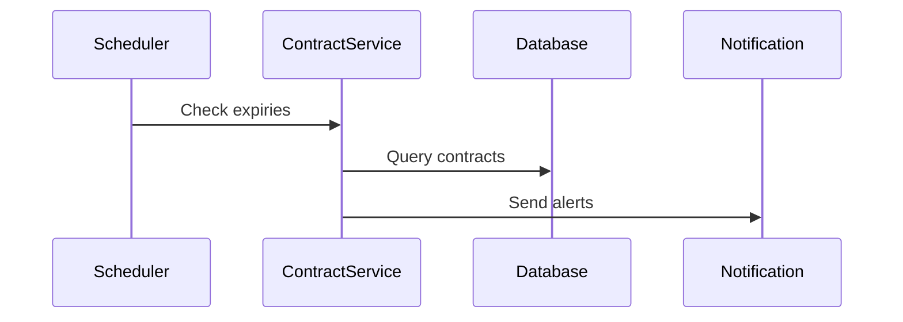
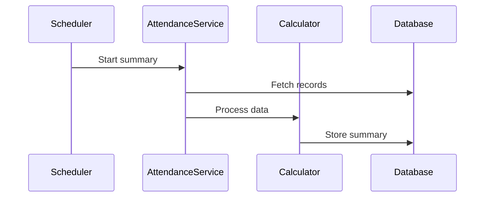
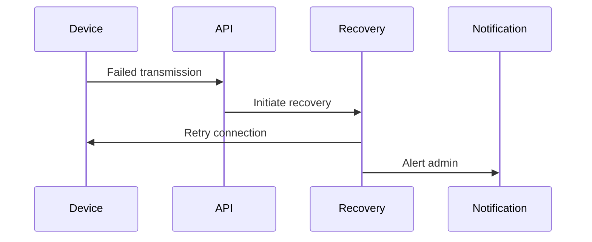
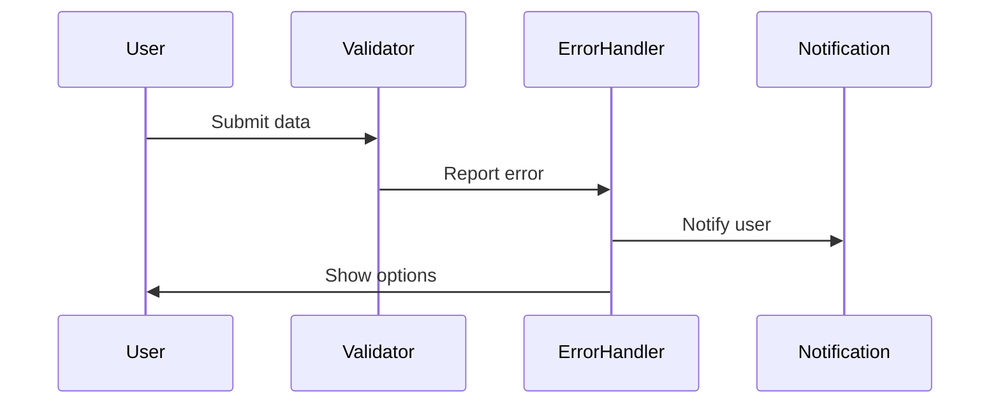

# Runtime View

## Overview

This document describes key runtime scenarios and their execution flows in the SEP_HRMS system. Each scenario illustrates the interaction between system components and external actors.

## Core Scenarios

### 1. Employee Attendance Recording

#### Attendance Recording Scenario

ZKTeco device records an employee's attendance and sends it to the system.

#### Attendance Recording Flow

1. **Device Authentication**
   - ZKTeco device generates HMAC signature
   - System validates device credentials
   - Connection established with API endpoint

2. **Data Transmission**
   - Device sends attendance record
   - System validates payload format
   - Record queued for processing

3. **Record Processing**
   - AttendanceService processes record
   - Employee validation performed
   - Timestamp verification executed
   - Record stored in database

4. **Post-Processing**
   - Attendance summary updated
   - Notifications dispatched if needed
   - Audit log entry created

### 2. Payroll Processing

#### Payroll Processing Overview

Monthly payroll generation for all active employees.

#### Payroll Processing Steps

1. **Initialization**
   - Payroll run created
   - Active employees listed
   - Configuration loaded

2. **Salary Calculation**
   - Base salary retrieved
   - Allowances calculated
   - Deductions processed
   - Net salary computed

3. **Document Generation**
   - Payslips created
   - PDF files generated
   - Documents stored

4. **Finalization**
   - Notifications sent
   - Records archived
   - Audit trail updated

### 3. Document Management

#### Document Management Overview

Employee document upload and version control.

#### Document Management Flow

1. **Upload Initiation**
   - File received
   - Type validation
   - Size verification
   - Virus scanning

2. **Processing**
   - Metadata extraction
   - Version check
   - Storage preparation

3. **Storage**
   - File encrypted
   - Metadata stored
   - Version created
   - Access rights set

4. **Completion**
   - URLs generated
   - Notifications sent
   - Audit logged

## Background Processes

### 1. Contract Expiry Monitoring

#### Contract Monitoring Overview

Daily check for contracts nearing expiration.

#### Contract Monitoring Steps

1. **Scanning**
   - Query active contracts
   - Check expiry dates
   - Identify near-expiry

2. **Notification**
   - Generate alerts
   - Send emails
   - Update dashboard

### 2. Attendance Summary Generation

#### Summary Generation Overview

Nightly process to generate attendance summaries.

#### Summary Generation Steps

1. **Data Collection**
   - Fetch daily records
   - Group by employee
   - Calculate durations

2. **Processing**
   - Apply business rules
   - Calculate overtime
   - Update summaries

## Error Handling

### 1. Device Communication Failure

#### Device Failure Overview

ZKTeco device connection or data transmission fails.

#### Device Recovery Steps

1. **Detection**
   - Timeout monitoring
   - Error logging
   - Status update

2. **Recovery**
   - Retry mechanism
   - Fallback protocol
   - Alert generation

### 2. Data Validation Errors

#### Validation Error Overview

Invalid or inconsistent data detected during processing.

#### Validation Error Handling

1. **Validation**
   - Data checking
   - Rule verification
   - Error collection

2. **Response**
   - Error logging
   - User notification
   - Recovery options

