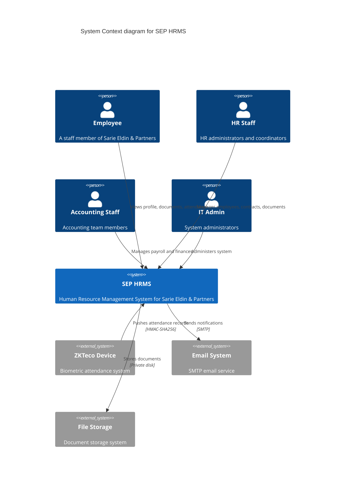

# C4 Context Diagram - SEP HRMS

## TL;DR
High-level context diagram showing the main system components and external actors.

```mermaid
C4Context
    title System Context diagram for SEP HRMS

    Person(employee, "Employee", "A staff member of Sarie Eldin & Partners")
    Person(hr, "HR Staff", "HR administrators and coordinators")
    Person(accountant, "Accounting Staff", "Accounting team members")
    Person(it, "IT Admin", "System administrators")

    System(hrms, "SEP HRMS", "Human Resource Management System for Sarie Eldin & Partners")

    System_Ext(zkteco, "ZKTeco Device", "Biometric attendance system")
    System_Ext(email, "Email System", "SMTP email service")
    System_Ext(storage, "File Storage", "Document storage system")

    Rel(employee, hrms, "Views profile, documents, attendance")
    Rel(hr, hrms, "Manages employees, contracts, documents")
    Rel(accountant, hrms, "Manages payroll and finances")
    Rel(it, hrms, "Administers system")

    Rel(zkteco, hrms, "Pushes attendance records", "HMAC-SHA256")
    Rel(hrms, email, "Sends notifications", "SMTP")
    Rel(hrms, storage, "Stores documents", "Private disk")

    UpdateLayoutConfig($c4ShapeInRow="3", $c4BoundaryInRow="1")
```