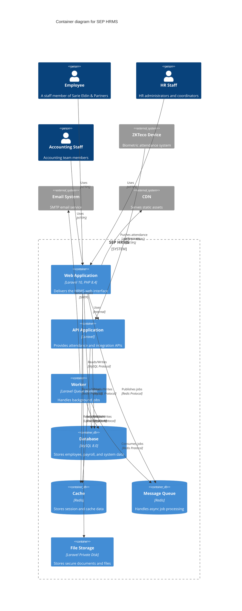

# C4 Container Diagram - SEP HRMS

## TL;DR
Container-level diagram showing the major system components.

```mermaid
C4Container
    title Container diagram for SEP HRMS

    Person(employee, "Employee", "A staff member of Sarie Eldin & Partners")
    Person(hr, "HR Staff", "HR administrators and coordinators")
    Person(accountant, "Accounting Staff", "Accounting team members")

    System_Boundary(hrms, "SEP HRMS") {
        Container(web_app, "Web Application", "Laravel 10, PHP 8.4", "Delivers the HRMS web interface")
        Container(api, "API Application", "Laravel", "Provides attendance and integration APIs")
        Container(worker, "Worker", "Laravel Queue Worker", "Handles background jobs")
        
        ContainerDb(db, "Database", "MySQL 8.0", "Stores employee, payroll, and system data")
        ContainerDb(cache, "Cache", "Redis", "Stores session and cache data")
        ContainerDb(queue, "Message Queue", "Redis", "Handles async job processing")
        
        Container(storage, "File Storage", "Laravel Private Disk", "Stores secure documents and files")
    }

    System_Ext(zkteco, "ZKTeco Device", "Biometric attendance system")
    System_Ext(email, "Email System", "SMTP email service")
    System_Ext(cdn, "CDN", "Serves static assets")

    Rel(employee, web_app, "Uses", "HTTPS")
    Rel(hr, web_app, "Uses", "HTTPS")
    Rel(accountant, web_app, "Uses", "HTTPS")

    Rel(web_app, api, "Uses", "Internal")
    Rel(web_app, db, "Reads/Writes", "MySQL Protocol")
    Rel(web_app, cache, "Reads/Writes", "Redis Protocol")
    Rel(web_app, storage, "Reads/Writes", "Local Filesystem")
    Rel(web_app, queue, "Publishes jobs", "Redis Protocol")

    Rel(api, db, "Reads/Writes", "MySQL Protocol")
    Rel(api, cache, "Reads/Writes", "Redis Protocol")
    
    Rel(worker, queue, "Consumes jobs", "Redis Protocol")
    Rel(worker, db, "Reads/Writes", "MySQL Protocol")
    Rel(worker, email, "Sends emails", "SMTP")
    
    Rel(zkteco, api, "Pushes attendance", "HTTPS + HMAC")
    Rel(web_app, cdn, "Loads assets", "HTTPS")

    UpdateLayoutConfig($c4ShapeInRow="3", $c4BoundaryInRow="1")
```