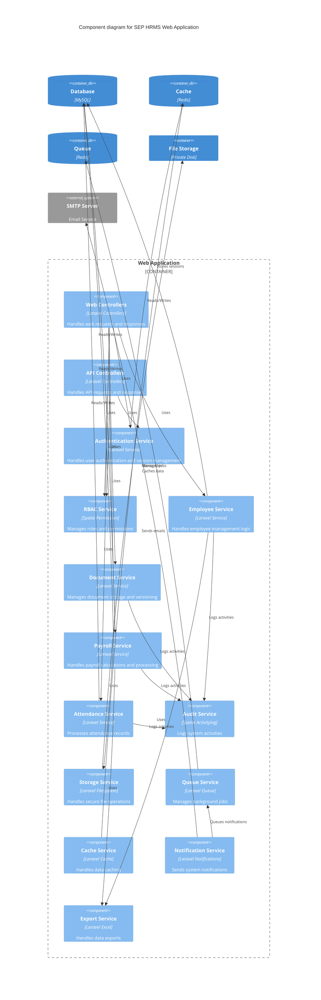

# C4 Component Diagram - SEP HRMS

## TL;DR
Component-level diagram showing the internal structure of the web application container.

```mermaid
C4Component
    title Component diagram for SEP HRMS Web Application

    Container_Boundary(web, "Web Application") {
        Component(web_controller, "Web Controllers", "Laravel Controllers", "Handles web requests and responses")
        Component(api_controller, "API Controllers", "Laravel Controllers", "Handles API requests and responses")
        
        Component(auth_service, "Authentication Service", "Laravel Service", "Handles user authentication and session management")
        Component(rbac_service, "RBAC Service", "Spatie Permission", "Manages roles and permissions")
        
        Component(emp_service, "Employee Service", "Laravel Service", "Handles employee management logic")
        Component(doc_service, "Document Service", "Laravel Service", "Manages document storage and versioning")
        Component(pay_service, "Payroll Service", "Laravel Service", "Handles payroll calculations and processing")
        Component(att_service, "Attendance Service", "Laravel Service", "Processes attendance records")
        
        Component(audit_service, "Audit Service", "Spatie Activitylog", "Logs system activities")
        Component(storage_service, "Storage Service", "Laravel Filesystem", "Handles secure file operations")
        
        Component(queue_service, "Queue Service", "Laravel Queue", "Manages background jobs")
        Component(cache_service, "Cache Service", "Laravel Cache", "Handles data caching")
        
        Component(notification_service, "Notification Service", "Laravel Notifications", "Sends system notifications")
        Component(export_service, "Export Service", "Laravel Excel", "Handles data exports")
    }

    ContainerDb(db, "Database", "MySQL")
    ContainerDb(cache, "Cache", "Redis")
    ContainerDb(queue, "Queue", "Redis")
    Container(storage, "File Storage", "Private Disk")

    System_Ext(smtp, "SMTP Server", "Email Service")

    Rel(web_controller, auth_service, "Uses")
    Rel(web_controller, rbac_service, "Uses")
    Rel(web_controller, emp_service, "Uses")
    Rel(web_controller, doc_service, "Uses")
    Rel(web_controller, pay_service, "Uses")

    Rel(api_controller, auth_service, "Uses")
    Rel(api_controller, rbac_service, "Uses")
    Rel(api_controller, att_service, "Uses")

    Rel(emp_service, audit_service, "Logs activities")
    Rel(doc_service, audit_service, "Logs activities")
    Rel(pay_service, audit_service, "Logs activities")
    Rel(att_service, audit_service, "Logs activities")

    Rel(doc_service, storage_service, "Uses")
    Rel(storage_service, storage, "Stores files")

    Rel(emp_service, export_service, "Uses")
    Rel(pay_service, export_service, "Uses")

    Rel(notification_service, smtp, "Sends emails")
    Rel(notification_service, queue_service, "Queues notifications")
    
    Rel(emp_service, db, "Reads/Writes")
    Rel(doc_service, db, "Reads/Writes")
    Rel(pay_service, db, "Reads/Writes")
    Rel(att_service, db, "Reads/Writes")
    
    Rel(auth_service, cache, "Stores sessions")
    Rel(cache_service, cache, "Caches data")
    Rel(queue_service, queue, "Manages jobs")

    UpdateLayoutConfig($c4ShapeInRow="4", $c4BoundaryInRow="1")
```