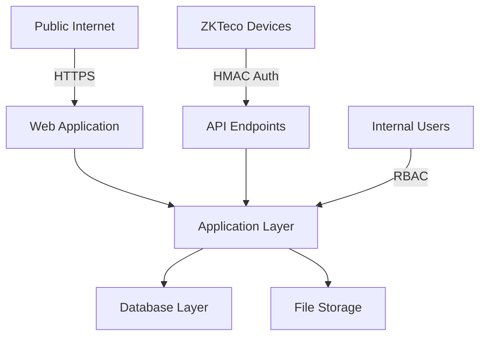

# Security Review - SEP HRMS

## TL;DR
This document outlines the security architecture, potential threats, and mitigations for the Sarie Eldin & Partners HRMS system, focusing on authentication, authorization, data protection, and API security.

## 1. Authentication & Authorization

### Authentication Flows
- Laravel Sanctum for web/API authentication
- Session-based authentication for web interface
- API key authentication for ZKTeco device integration
- Password reset functionality with email verification
- Remember-me token functionality

### Authorization Model
- Role-Based Access Control (RBAC) using Spatie Permission package
- Six core roles with strict permission hierarchy:
  1. HR Admin Manager (full system access)
  2. Accounting Manager (full payroll access)
  3. HR Coordinator (limited payroll visibility)
  4. Accountant (no salary access)
  5. Employee (self-service only)
  6. IT Admin (system management)

### Permission Examples
```php
// Employee Policy
public function update(User $user, Employee $employee)
{
    return $user->hasAnyRole(['HR_Admin_Manager', 'HR_Coordinator']) ||
           ($user->employee && $user->employee->id === $employee->id);
}

// Salary Visibility
public function canViewSalaryInformation(User $user): bool 
{
    return $user->hasAnyRole(['HR_Admin_Manager', 'Accounting_Manager']);
}
```

## 2. Sensitive Data Protection

### Field-Level Encryption
- National IDs encrypted at rest
- Salary information encrypted at rest
- Private documents stored outside web root

### File Access Control
- Private disk configuration with signed URLs
- Document watermarking for confidential files
- Role-based document access control
```php
'private' => [
    'driver' => 'local',
    'root' => storage_path('app/private'),
    'visibility' => 'private',
]
```

### Data Masking
- Salary information masked for unauthorized roles
- National ID display limited to authorized personnel
- Personal data visibility controlled by policies

## 3. API Security

### Authentication Methods
- Sanctum bearer tokens for authenticated endpoints
- HMAC-SHA256 signatures for device integration
- Rate limiting on authentication endpoints

### Input Validation
- Form requests with validation rules
- File upload validation (size, type, extension)
- SQL injection prevention through Laravel ORM
- XSS prevention through auto-escaping

### API Protection
```php
// API Rate Limiting
'api' => [
    'throttle:api',
    \App\Http\Middleware\HandleAPIKey::class,
]
```

## 4. OWASP Top 10 Analysis

### 1. Broken Access Control
**Status**: Protected
- Role-based access control implemented
- Resource authorization through policies
- Session management with secure defaults
- Direct object reference checks

### 2. Cryptographic Failures
**Status**: Protected
- Uses Laravel's encryption mechanisms
- Sensitive data encrypted at rest
- HTTPS enforced in production
- Secure key management

### 3. Injection
**Status**: Protected
- Laravel ORM prevents SQL injection
- Input validation on all forms
- Output escaping by default
- File upload validation

### 4. Insecure Design
**Status**: Protected
- Clear separation of concerns
- Two-step approval for critical operations
- Activity logging for audit trails
- Role-based UI elements

### 5. Security Misconfiguration
**Status**: Protected
- Environment-based configuration
- Secure defaults in production
- Error handling configured
- Debug mode disabled in production

### 6. Vulnerable Components
**Status**: Protected
- Dependencies managed through Composer
- Regular security updates
- Auto-update notifications
- Development dependencies separated

### 7. Authentication Failures
**Status**: Protected
- Strong password policies
- Rate limiting on auth endpoints
- Session security configuration
- Remember-me token security

### 8. Software & Data Integrity Failures
**Status**: Protected
- Composer package integrity checks
- File integrity validation
- HMAC signature verification
- Audit trails for changes

### 9. Security Logging & Monitoring
**Status**: Protected
- Comprehensive activity logging
- Critical operation auditing
- Error logging configured
- Weekly security digests

### 10. Server-Side Request Forgery
**Status**: Protected
- Internal URLs validation
- Network access restrictions
- Input validation on URLs
- API endpoint whitelisting

## 5. Threat Model

### Assets
1. Employee Personal Data
   - National IDs (encrypted)
   - Salary information (encrypted)
   - Contact details
   
2. Financial Data
   - Payroll calculations
   - Bank account details
   - Salary structures
   
3. Documents
   - Employment contracts
   - Legal documents
   - Personal files

4. System Access
   - User credentials
   - API keys
   - Session tokens

### Trust Boundaries



### Threats & Mitigations

1. **Unauthorized Data Access**
   - RBAC implementation
   - Field-level encryption
   - Audit logging
   
2. **API Abuse**
   - Rate limiting
   - HMAC authentication
   - Input validation
   
3. **Data Leakage**
   - Encrypted storage
   - Private file system
   - Data masking
   
4. **Session Hijacking**
   - Secure session configuration
   - HTTPS enforcement
   - Token security

## 6. ASVS Checklist

### V1: Architecture, Design and Threat Modeling
- [x] Security architecture documented
- [x] All components identified
- [x] High-value data flows mapped
- [x] Threat model established
- [x] Security controls centralized

### V2: Authentication
- [x] Password security (storage, complexity)
- [x] Session management secure
- [x] Token-based authentication
- [x] API authentication
- [x] Credential recovery secure

### V3: Session Management
- [x] Session timeout configured
- [x] Secure session storage
- [x] Session invalidation on logout
- [x] Remember-me functionality secure

### V4: Access Control
- [x] Role-based access control
- [x] Resource authorization
- [x] Data-level access control
- [x] File access control

### V7: Error Handling and Logging
- [x] Error messages don't leak data
- [x] Activity logging implemented
- [x] Audit trail for sensitive operations
- [x] Log injection prevention

### V9: Communications
- [x] TLS configuration
- [x] API endpoint security
- [x] HMAC implementation
- [x] File transfer security

### V10: Malicious Code
- [x] Dependencies scanned
- [x] Input validation
- [x] Output encoding
- [x] File validation

## 7. Security Recommendations

1. **Short Term**
   - Implement password complexity requirements
   - Add MFA for privileged accounts
   - Configure security headers

2. **Medium Term**
   - Implement real-time security monitoring
   - Add automated vulnerability scanning
   - Enhance audit log analysis

3. **Long Term**
   - Consider implementing Zero Trust
   - Add behavioral analysis
   - Implement advanced threat detection

## 8. Security Contact

For security issues or vulnerabilities, contact:
- Primary: IT Admin (`it@sarieldin.com`)
- Secondary: HR Admin Manager (`hr@sarieldin.com`)